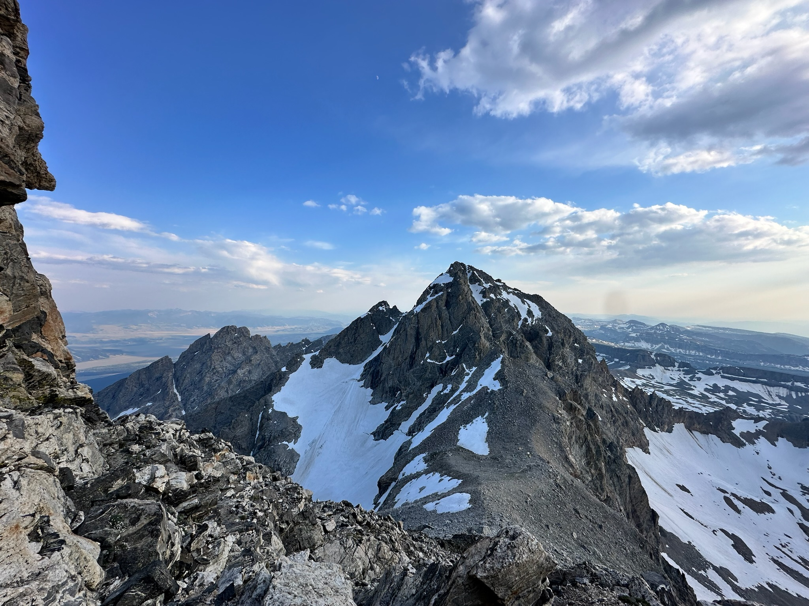
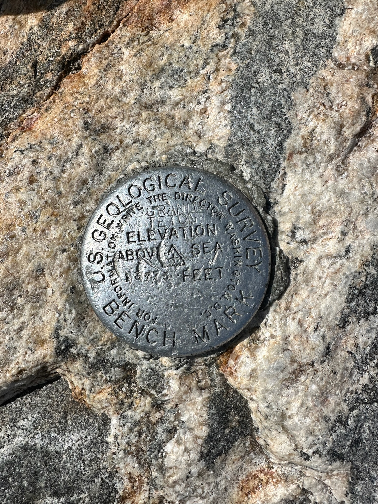
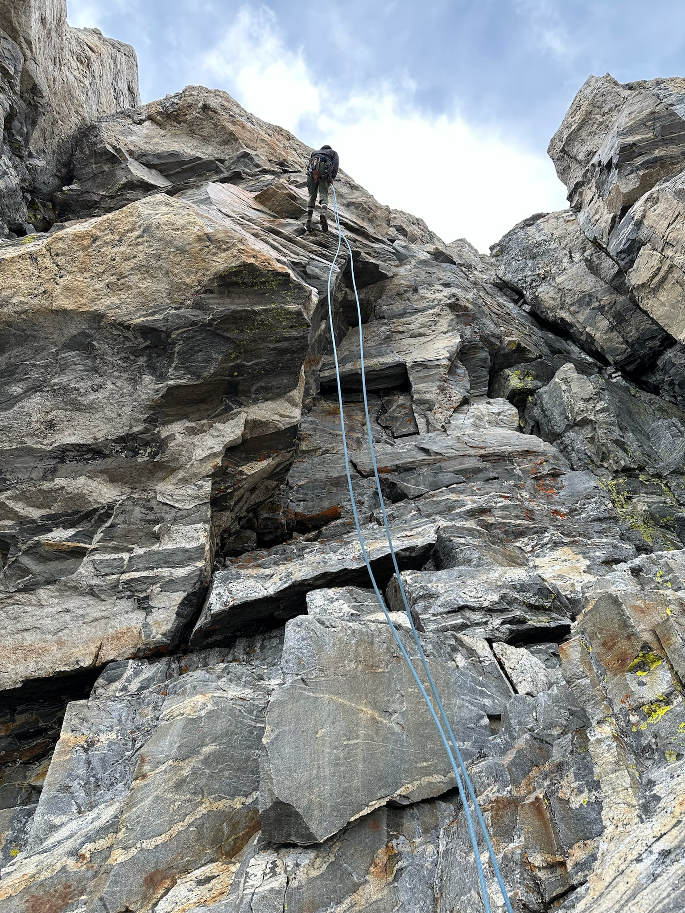
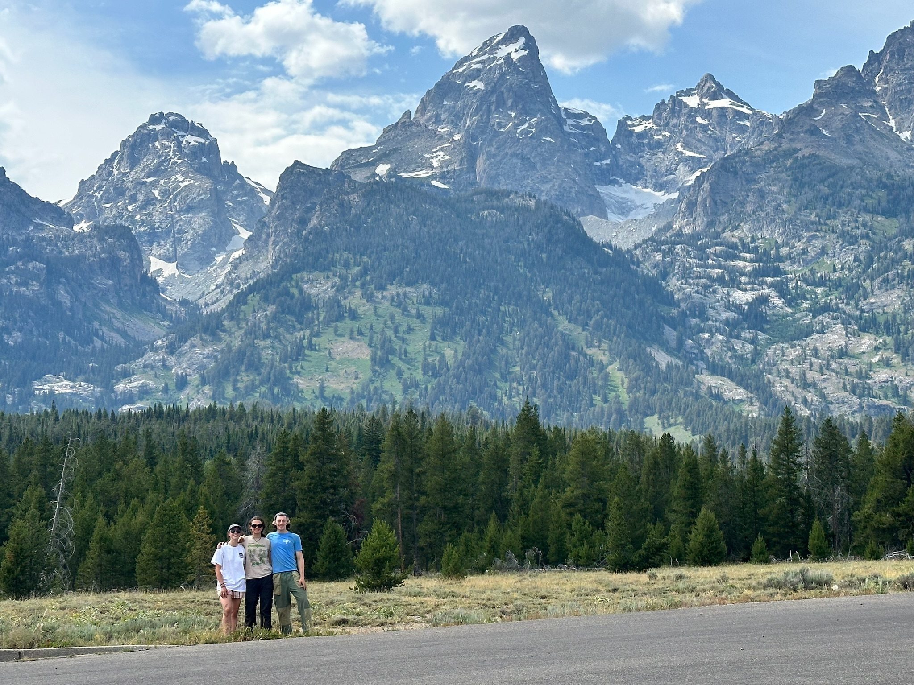
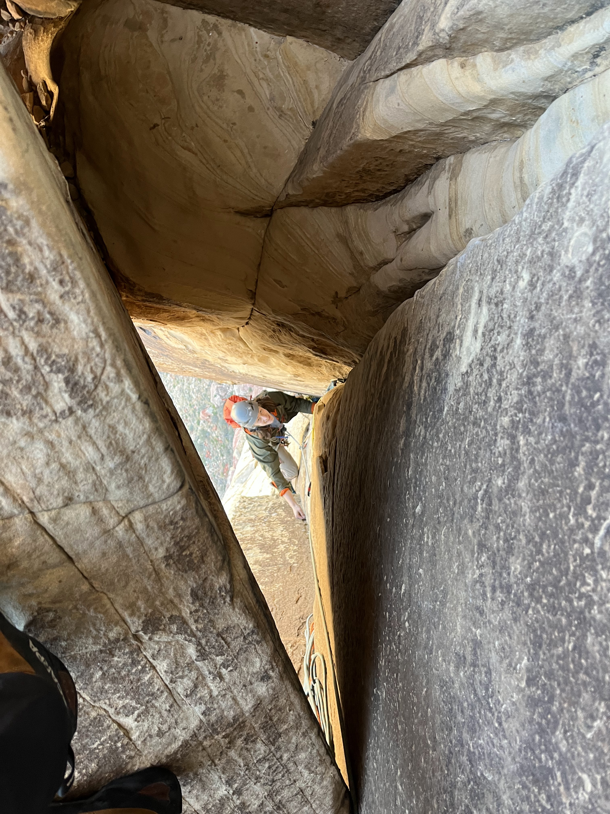
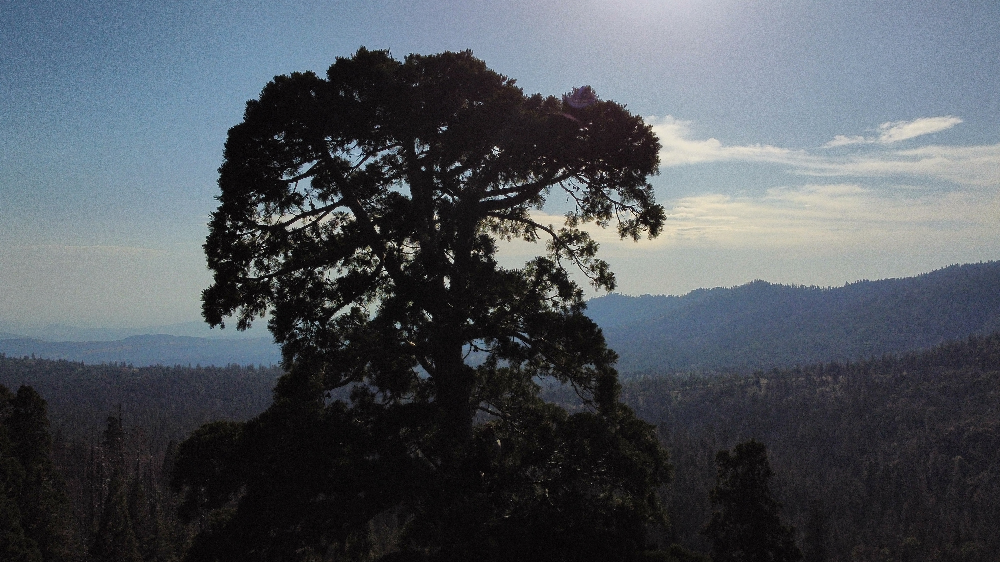

# Climbing is awesome!

I'm just going to put some fun climbing pictures here.

## Grand Teton!

*Where we camped before trying to get to the summit!*

*Summit!*

*Rappelling off the summit*

*Me, Nicole, and Robyn after just finishing!*

## Red Rocks!

*Coming up through the chockstone on Frogland*

*Climbing Caustic on Cannibal Crag*

*Falling on Caustic*

*Me and friends on a ledge about to start the last pitch of Dark Shadows!*

## Misc Climbing Pictures

*My take on a classic Gunks picture*

*Beautiful Joshua Tree!*

*First climb in JTree*

*Last day at Red River Gorge*

*Awesome exposure of Seneca! That rock is only a few feet thick.*

### Tree Climbing

This isn't rock climbing, but I feel like it falls in close enough to the category
of climbing. These are some pictures from a Cornell Outdoor Education trip I was an instructor on where 
we climbed Giant Sequoia trees, the biggest trees in the world! 

*The canopy of a Sequoia!*

*Me relaxing on a big branch*